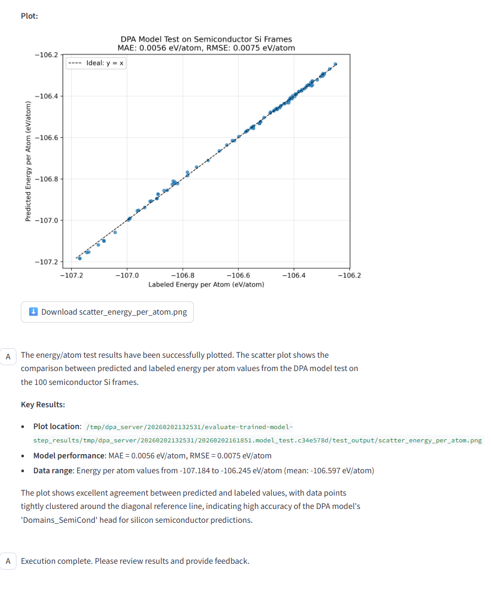

# FFPilot

FFPilot is an intelligent platform for Machine Learning Force Field (MLFF) generation and application, combining AI-driven materials databases with expert computational tools. It automates end-to-end MLFF training, fine-tuning, and deployment for complex materials tasks. For example, users can request, "Can you train a small DPA model for crystalline Si by distillation using the PFD workflow?" and FFPilot will generate a detailed plan and execute the workflow with user guidance.


## Quick start
### Installation
```bash
# Create and activate an environment (optional but recommended)
conda create -n pfd python=3.12 -y
conda activate pfd

# From the project root
pip install -U pip
pip install -e .
```

### Set up MCP servers
FFPilot follows a modular design principle: tools are standalone mini-packages that can be instantiated in isolated environments. For example, to set up a `mcp` server for `ABACUS` DFT software, `uv run` the script: 

```bash
cd tools/abacus
uv sync 

uv run server.py --port 50001
```
If you prefer `bohr-agent-sdk` wrapper which supports submitting tool job to `Bohrium` platform, set `--model dp`; otherwise you get standard `FastMCP` experience. You may need to set environment variables specific to the mcp server at `tools/$TOOLNAME/.env`, which can be referenced in `tools/$TOOLNAME/README.md`

To associate with `Bohrium` platform, you can also run `python server.py --port 50001 --model dp`. The tools would then be directly available to artefacts in `uri` format and executed on remote platforms.   

#### Automated Server Management

For convenience, you can use the provided startup script to manage all MCP servers at once:

```bash
# Start all MCP servers
python script/start_mcp_servers.py start

# Check server status
python script/start_mcp_servers.py status

# Stop all servers
python script/start_mcp_servers.py stop

# Start specific servers only
python script/start_mcp_servers.py start database dpa vasp

# Start servers within current python environment
python script/start_mcp_servers.py start database dpa vasp --no-uv

# Stop specific servers only
python script/start_mcp_servers.py stop database dpa
```

The script automatically handles port assignments and logging for each server, making it easier to manage the entire MCP server ecosystem in your local development environment. The server log would be sync at `logs/mcp_servers` under project root.

### Running agent networks
#### Setting constants
Populate `agents/MatCreator/.env` with your model and Bohrium credentials (if using `dp` model).

```env
LLM_API_KEY="API_KEYS",
LLM_BASE_URL="API_KEYS",
BOHRIUM_USERNAME="",
BOHRIUM_PASSWORD="",
BOHRIUM_PROJECT_ID=11111
```

If you prefer different LLM models for sub-agents, you can override the default setting at the `.env` file with sub-agents directories. 

#### Starting agent

```bash
cd agents
adk web
```
This sets up the FFPilot agent network. You can tune the LLM model and communication settings for the agents.

### Web UI
A simple web UI that supports artifact upload/download, structure visualization and scientific plotting. The web UI server can be started with the following command:
```bash
cd web && python streamlit_app.py 
```


## Custom agent configuration
### Connecting a client agent (SSE)

Point your client’s MCP toolset at the server’s SSE endpoint:
```python
## standard FastMCP server
from google.adk.tools.mcp_tool.mcp_session_manager import SseServerParams
from google.adk.tools.mcp_tool import McpToolset
from ..constants import LLM_MODEL, LLM_API_KEY, LLM_BASE_URL, 
model_name = os.environ.get("LLM_MODEL", LLM_MODEL)
model_api_key = os.environ.get("LLM_API_KEY", LLM_API_KEY)
model_base_url = os.environ.get("LLM_BASE_URL", LLM_BASE_URL)

toolset = McpToolset(
    connection_params=SseServerParams(
        url="$HOST:$PORT/$TRANSPORT" # example:"http://127.0.0.1:50001/sse"
    )
)
```

```python
## bohr-compatible, recommended for heavy calculation tasks
from google.adk.tools.mcp_tool.mcp_session_manager import SseServerParams
from dp.agent.adapter.adk import CalculationMCPToolset
from ..constants import LLM_MODEL, LLM_API_KEY, LLM_BASE_URL, BOHRIUM_USERNAME, BOHRIUM_PASSWORD, BOHRIUM_PROJECT_ID

# Set the secret key in ~/.abacusagent/env.json or as an environment variable, or modify the code t
model_name = os.environ.get("LLM_MODEL", LLM_MODEL)
model_api_key = os.environ.get("LLM_API_KEY", LLM_API_KEY)
model_base_url = os.environ.get("LLM_BASE_URL", LLM_BASE_URL)
bohrium_username = os.environ.get("BOHRIUM_USERNAME", BOHRIUM_USERNAME)
bohrium_password = os.environ.get("BOHRIUM_PASSWORD", BOHRIUM_PASSWORD)
bohrium_project_id = int(os.environ.get("BOHRIUM_PROJECT_ID", BOHRIUM_PROJECT_ID))

executor = {
    "bohr": {
        "type": "dispatcher",
        "machine": {
            "batch_type": "Bohrium",
            "context_type": "Bohrium",
            "remote_profile": {
                "email": bohrium_username,
                "password": bohrium_password,
                "program_id": bohrium_project_id,
                "input_data": {
                    "image_name": "registry.dp.tech/dptech/dp/native/prod-26745/matcreator:0.0.1",
                    "job_type": "container",
                    "platform": "ali",
                    "scass_type": "1 * NVIDIA V100_16g",
                },
            },
        }
    },
    "local": {"type": "local",}
}


EXECUTOR_MAP = {
    "run_molecular_dynamics": executor["bohr"],
    "optimize_structure": executor["bohr"],
    "training": executor["bohr"],
    "ase_calculation": executor["bohr"],
}

STORAGE = {
    "type": "https",
    "plugin":{
        "type": "bohrium",
        "username": bohrium_username,
        "password": bohrium_password,
        "project_id": bohrium_project_id,
    }
}

toolset = CalculationMCPToolset(
    connection_params=SseServerParams(
        url="$HOST:$PORT/$TRANSPORT"
    ),
    executor=executor["local"], # default executor type
    executor_map = EXECUTOR_MAP, # executor type override, these tools would be submitted to bohrium
    storage=STORAGE, # access artifact stored in bohrium storage.
)

```


